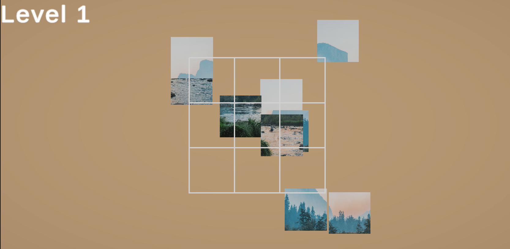

# Jigsaw Puzzle Game (Unity)

🎮 A 3D Jigsaw Puzzle game developed in Unity with interactive challenges.

## Features
- Custom puzzle pieces and 3D models
- Drag & drop mechanics
- Timer & scoring system
- WebGL playable build

## Tech Stack
- Unity
- C#
- Blender (3D models)

## Controls
- Mouse: Drag & rotate pieces
- Keyboard: N/A

## Gameplay Screenshots

## Play Build
🌐 [Play Online](https://serene-brioche-6643db.netlify.app/)
